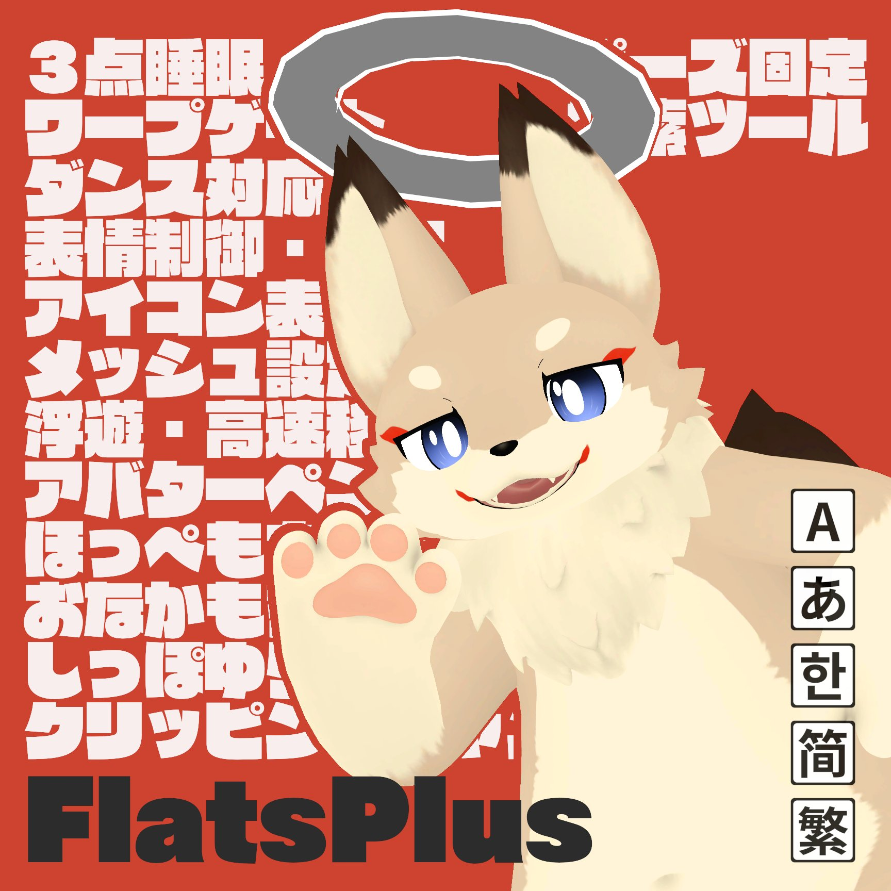
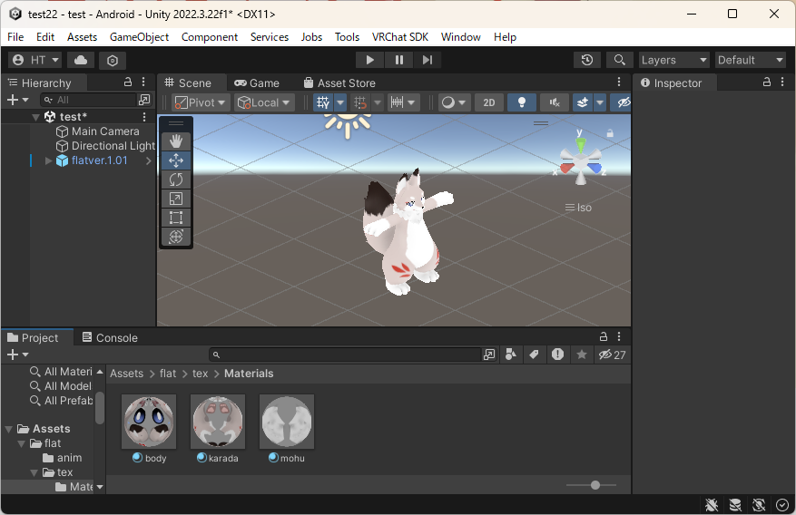
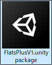
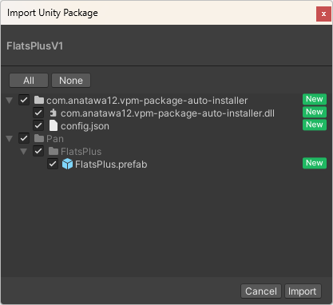
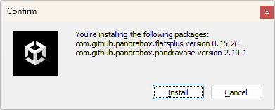
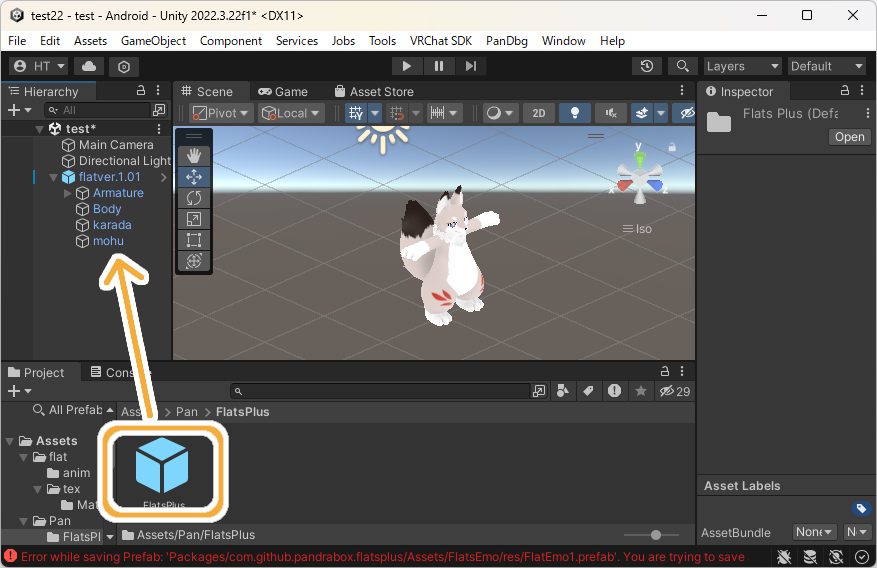
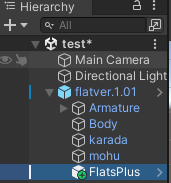
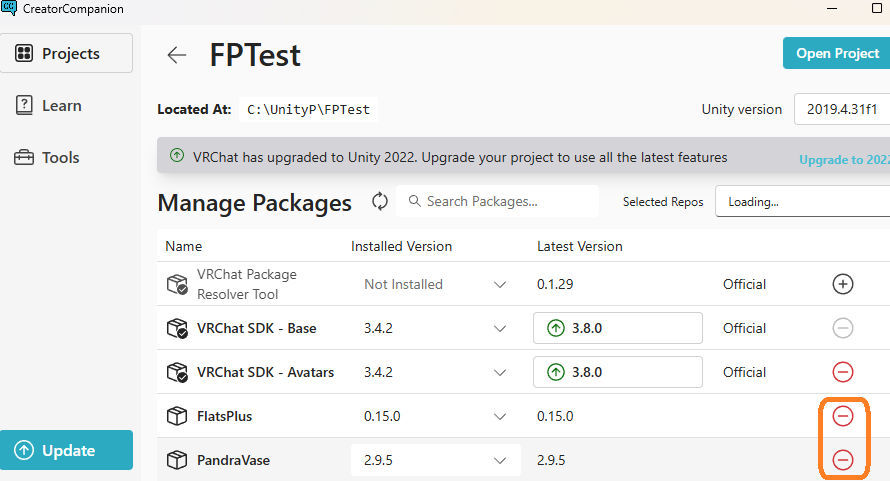
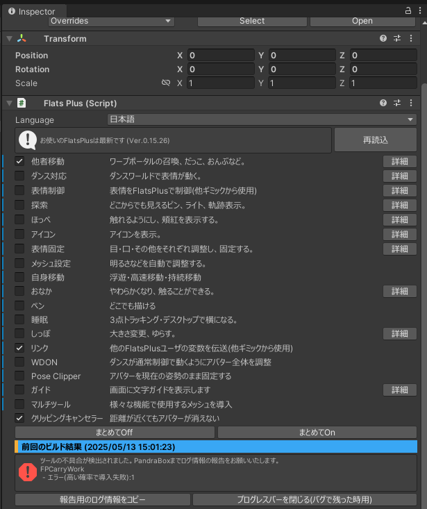

# 概要

FlatsPlusはフラット族(フラット・コモド・フェル・ヘオン・キューフ)に**かわいい**と**便利**を追加します。

# 導入方法

| No | 内容 | 画像 |
| ---- | ---- | ---- |
| 1 | フラット族のUnity環境を準備する |  |
| 2 | pandraboxのBoothからFlatsPlusをダウンロードする |  |
| 3 | ファイルを開き、FlatsPlusV1.unitypackageをインポートする |   |
| 4 | メッセージが出るので、Installを押す |  |
| 5 | Assets/Pan/FlatsPlus/FlatsPlus.prefabをアバター直下に入れる |   |
| 6 | 導入完了！アップロードしてお楽しみください ※アップロードに通常より時間がかかります。気長にお待ちください |  |

# 代表的な機能
カスタムしない場合、次の機能が使用可能です

## 常時発動
- ダンス対応 … 多くのダンスワールドで表情が動く
- ほっぺ … 触ったり、伸ばしたりできる。手を近づけると、頬紅が出る
- メッシュ設定 … アバター全体の明るさを調整し、服や頭だけ色が変わることを防ぐ
- おなか … 柔らかくなり、触ることができる
- しっぽ … 揺れる
- クリッピングキャンセラー … 近づいたとき、消えない

## 睡眠
-  有効 … 睡眠モードにする
-  移動ロック … 移動できないようにする
-  高さ … 足(モーションロック時は全身)の高さを変更
-  Lock:モーション … 全身を既定の睡眠姿勢でロック
-  Lock:今の姿勢 … 全身を現状の姿勢でロック

## しっぽ
-  大きさ … しっぽの大きさを変更
-  揺らす … しっぽを揺らす

## ペン
-  描画 … ペンを有効にする。右手をFistにすると書くことができる
-  削除 … 消しゴムを有効にする。右手をFistにすると消すことができる
-  クリア … 全ての描画を消す
-  色 … ペンの色を変える

## 他者移動
-  灰ゲート召喚 … 他者がテレポートできる灰色のゲートをつくる。自分は使えない。※他者には赤く見える
-  灰ゲート有効 … 灰色のゲートの表示状態を切り替える
-  青ゲート召喚 … 自分がテレポートできる青色のゲートをつくる。他者には見えない。※周囲にFlatsPlusの利用者が必要
-  青のゲート許可 … 青ゲート召喚で自身の場所にゲートを作成されることを許可する
-  抱っこ … 他者が手に乗れる
-  おんぶ … 他者が背中に乗れる
-  距離調整 … 抱っこ・おんぶの距離を調整する
-  角度調整 … 灰ゲート・抱っこ・おんぶの角度を調整する

## 自身移動
- 飛行＆高速移動 … 空を飛んだり、高速移動したりする。移動速度が0のときは飛行。ジャンプボタンを連打で飛ぶことができる。移動速度を上げると高速移動。空中ジャンプで前に向かって高速で移動する
-  移動速度 … 移動速度を変更する
-  ホバリング … ホバリング移動する。ジャンプしてから前に移動すると、空中を緩やかに移動する
-  ホバリング上下 … ホバリング中に継続的に上昇・下降する度合いを調整する

##  表情固定
-  有効 … 表情固定を有効にする
-  目 … 固定する目の種類
-  目の強度 … 固定時の目の反映度合い
-  口 … 固定時の口の形
-  その他 … その他の表情
-  リセット … 表情固定の設定をリセット

## ダンス設定
-  モード:OFF … ダンス機能をOFF
-  モード:通常 … 多くのダンスを自動で検出し、誤検出が少ない
-  モード:パワフル … ほぼすべてのダンスを自動で検出するが、誤検出することがある
-  FX有効 … ダンス中、FXをONにする（ONを推奨。OFFにすると、より表情が動きやすくなるが、衣装などで同期の問題が発生する）

## ガイド
-  有効 … ガイドの表示を切り替える
-  サイズ … ガイド文字サイズを変更する

##  アイコン
各種アイコンを頭上に表示する

##  探索
-  ピン … 遠くから見えるピンを頭上に表示する
-  前方ライト … 前を照らす
-  周囲ライト … 辺りを照らす
-  明るさ … ライトの明るさを調整
-  ライトグローバル化 … ライトを他の人にも見えるようにする
-  軌跡 … 自分の通ったルートを描画する
-  軌跡削除 … 軌跡を消す
-  色 … 軌跡の色を変更

## PoseClipper
本機能は[CHILD WITCH](https://childwitch.booth.pm/)様開発[PoseClipper](https://booth.pm/ja/items/6181080)の移植版です
- .png) Reset … PoseClipperを解除
-  WorldFixed … 体の位置を固定
- .png) AllClip … 全身を固定
- .png) PartsClip … 部位ごとに固定
- .png) Detail(Body) … 体の詳細ごとに固定
- .png) Detail(Arms) … 手の詳細ごとに固定
- .png) Detail(Legs … 脚の詳細ごとに固定

# Unity設定
## 概要
- FlatsPlusはUnityでカスタマイズすることができます。
- もっとも簡単なのは、一度「まとめてOff」にしてから、必要な機能だけチェックを入れていくことです。
  - チェックを入れると、他の機能も同時にチェックが入ることがあります。それは必要なものなので、消さないことをおすすめします。
- その他、詳細設定ができる機能もあり、より使いやすく設定するときに便利です。

## 他者移動
| 詳細項目 |  設定内容 | デフォルト |
| --- | --- | --- |
| 青ゲート許可 | 青ゲートを自分の場所に作る許可の初期値 | ON |
| 最大ゲート距離 | 灰ゲートを操作できる最大距離を変更 | 1 |

## ダンス対応
| 詳細項目 |  設定内容 | デフォルト |
| --- | --- | --- |
|ダンス制御タイプ|OFF…ダンス対応しない Normal…誤検出しない範囲で対応する Force…積極的に対応する|Normal|
|ダンスFx有効 | ダンスFxの初期値   ON…服などが同期されるが、アバターによって表情が動かないことがある。  OFF…必ず表情が動くが、同期の問題が発生する | ON |

## 表情制御
| 詳細項目 | 設定内容 | デフォルト |
| --- | --- | --- |
| 表情タイプ | どのように表情を制御するかの設定 Auto…アバターのデフォルト値 アバター名…そのアバターの表情操作 Custom…表情編集で作成した表情  アバターとタイプは一致していなくてよいです。 例：アバターはComodoで表情ジェスチャーをFlatにする（ない表情は出なくなります）| Auto |
| 表情編集 | ボタンを押すと各ジェスチャーごとの表情を詳細に設定できる | - |
| 変化時間 | 表情が変化するのにかかる時間を設定 数値が大きいほど、ゆっくりと表情が変化する | 0.5s |

## 探索
| 詳細項目 | 設定内容 | デフォルト |
| --- | --- | --- |
| ピン | 機能の有効性 | ON |
| 軌跡 | 機能の有効性 | ON |
| ライト | 機能の有効性 | ON |
| グローバルのデフォルト | ライトを他者にも見えるようにする初期値 | OFF |

## ほっぺ
| 詳細項目 | 設定内容 | デフォルト |
| --- | --- | --- |
| 接触許可 | ほっぺを触れるようにするかの設定 | ON |
| 伸ばす許可 | ほっぺを伸ばせるようにするかの設定 | ON |
| 伸ばす制限 | ほっぺが伸びる最大の長さを制限する | 1 |
| 頬紅 | 頬紅（照れ顔）機能の有効性 | ON |
| 頬紅感知距離 | 手を近づけたときに頬紅が出る距離を調整 | 1 |
| 元の頬紅を使用 | アバターの元々の頬紅シェイプキーを使用するか   (ない場合FlatsPlusオリジナル版になります) | ON |
| 頬紅制御タイプ | Auto…誰が触った時でも Other Only…他者の接触時のみ Without Dance…ダンス以外 On…常に表示 Off…表示しない | Without Dance |
| メニュー表示 | ほっぺの機能をメニューに表示するか | OFF |

## アイコン
| 詳細項目 | 設定内容 | デフォルト |
| --- | --- | --- |
| バージョン表示 | 他者のFlatsPlusバージョンを見る | OFF |
| 各種アイコン | 表示するアイコン画像 | ON |

## 表情固定
| 詳細項目 | 設定内容 | デフォルト |
| --- | --- | --- |
| メニューサイズ | メニューの大きさを調整 | 0.35 |
| ロックサイズ | 表情固定機能のUIサイズを調整 | 0.08 |
| メニュー透明度 | メニューの透明度を調整 | 0.85 |
| 余白サイズ | メニュー内の余白の大きさを調整 | 13 |
| スクロール速度 | スクロールの速さを調整 | 0.03 |
| デッドゾーン | コントローラーの入力を受け付ける最小値を調整 | 0.3 |

## おなか
| 詳細項目 | 設定内容 | デフォルト |
| --- | --- | --- |
| Pull | 標準的なPBの設定 | 0.5 |
| Spring | 標準的なPBの設定 | 0.8 |
| Gravity | 標準的なPBの設定 | 0.2 |
| Gravity FallOff | 標準的なPBの設定 | 1 |
| Immobile | 標準的なPBの設定 | 0.8 |
| LimitAngle | 標準的なPBの設定 | 20 |
| 半径調整 | おなかの接触判定の大きさを調整 | 1 |

## しっぽ
| 詳細項目 | 設定内容 | デフォルト |
| --- | --- | --- |
| 振れ周期 | しっぽの振れる速さを調整 | 1.5 |
| 揺れ角度 | しっぽの振れる角度の大きさを調整 | 60 |
| 最大サイズ | しっぽの最大サイズを設定 | 1 |
| 最小サイズ | しっぽの最小サイズを設定 | 0.015 |
| サイズ完全同期 | しっぽのサイズを他者と完全に同期するかの設定   ONにするとカクカクしてみえます。ONでもOFFでも他者からはカクカクします。 | OFF |
| デフォルトサイズ | しっぽの初期サイズを設定　  アバター標準サイズは0.5 | 0.5 |

## ガイド
| 詳細項目 | 設定内容 | デフォルト |
| --- | --- | --- |
| デフォルトアクティブ | ガイドを初期状態で表示するかどうかの設定 | ON |
| デフォルトサイズ | ガイドの初期サイズを設定 | 0.4 |

# 困った時は

## 動作しない
- FlatsPlusプレハブをアバター直下に入れているかどうか再確認をお願いします。

## ビルドに長い時間がかかる
- お手数をおかけしますが、技術上の制約となっております。環境によりますが、1～5分ほど必要です。

## エラーが出た
- FlatsPlusは、基本的にはエラーが出てもアップロードできるように設計されています。まずはあなたのアバターが無事であるかどうかご確認ください。
- とにかく目の前からエラーを解消したい場合は、アバターから「FlatsPlus」プレハブを削除してください。FlatsPlusによるほぼ全ての影響はこれでなくなるはずです！
  - どうしても問題がある場合は、アンインストールを試してください。
- 一度落ち着いたら「すべてOFF」にしてから、必要な機能だけ入れてもう一度試してみてください。もしかしたらそれで問題が解決するかもしれません。
  - 引き続き問題が起こる場合は、サポート窓口までご相談ください。

## 動けなくなった
- 睡眠、PoseClipperには自分のアバターが動けなくなるギミックが含まれており、操作できなくなることがあります。
  - もし原因が分かれば、その機能をOFFにしてください。
- 分からなければ、「アバターリセット」を試してください。問題が解決するはずです。

## ダンスで表情が動かない
- Unityの設定より「ダンス対応」「WDON」が有効であることを確認してください。
- ワールドによっては検出モードを「パワフル」にする必要があるので、試してみてください。
- それでも問題が続く場合は、ExpressionMenuより「Fx有効」をOFFにしてみてください。これはほぼすべてのアバターで表情問題を解決しますが、衣装の同期に問題が起きることに注意してください。

## その他の問題が発生した
- サポート窓口までご相談ください。

# アンインストール方法
- アバターからFlatsPlusプレハブを削除すれば、ほぼすべての影響は消えますが、より確実に削除する必要がある場合は次の通り実施してください。
- Assets/Pan/FlatsPlusフォルダを削除してください。
  - カスタム表情を作成した場合は、ここに保存されていますのでご注意ください。
- VCCでManage Projectを開いてください。
  - FlatsPlus、PandraVaseを削除してください。

# ライセンス

- [MITライセンス](https://github.com/pandrabox/DressingTable?tab=MIT-1-ov-file)によります。
- PoseClipperについてはフォルダ内同梱のライセンスをご確認ください。

# 動作環境

次の環境で動作します
- VRC 
  - PC
  - Mobile(Quest)
  - Mobile(Pico4)
  - Mobile(Pico4 Ultra)
- Unity
  - 2022.3.22f1
  - 2022.3.6f1
  - 2019.4.31f1
- VRC SDK
  - 3.4.2
- Modular Avatar 1.9.16
- Non-Destructive Modular Framework 1.4.1
- lilToon 1.8.5
  - 注意：Unity2019.4.31f1においてlilToon 1.9.0を使う場合問題が発生します
- アバター
  - [【オリジナル3Dモデル】フラット（Flat）](https://booth.pm/ja/items/3562180)
  - [【オリジナル3Dモデル】フラット（Flat）2nd Anniversary](https://booth.pm/ja/items/5780006)
  - [【オリジナル3Dモデル】コモド (Comodo)](https://booth.pm/ja/items/4046145)
  - [【オリジナル3Dモデル】フェル（Fel）](https://booth.pm/ja/items/4656076)
  - [【オリジナル3Dモデル】ヘオン（Heon）](https://booth.pm/ja/items/4849773)
  - [【オリジナル3Dモデル】キューフ（Kewf）](https://booth.pm/ja/items/5040290)
- 言語
  - メイン言語
    - ja
  - 対応言語（Unity・ExpressionMenu・GUIDE）（機械翻訳）
    - en, ko, zh-CN, zh-TW

# サポート窓口

## 連絡先
- 不具合報告・不明点・感想などお気軽にご連絡ください。お急ぎの際は複数窓口への連絡をお願いいたします。
  - [PandraBox問い合わせフォーム](https://forms.gle/x5TvUhqvWwBjQZcn6)
  - [Booth問い合わせフォーム](https://pandrabox.booth.pm/)
  - [X](https://x.com/pandra_gmk)

## エラー情報提供のお願い
- FlatsPlusでエラーが出た場合、次の方法でログを提供いただけますと解決にあたって非常に助かります。よろしければご協力お願いします。
  - FlatsPlusのプレハブをクリック
  - Inspectorをみる
  - 下のほうにある「報告用のログ情報をコピー」をクリック
  - データがコピーされるので、それを連絡先に送付してください。

